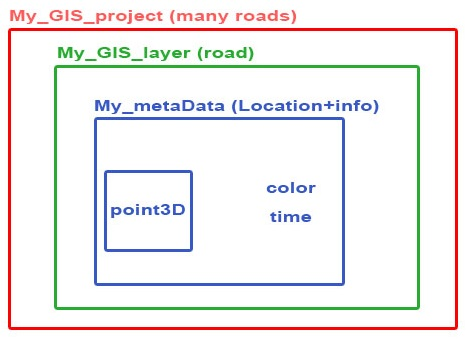

# ex02
A complex system that enables collection geographic information and production of insights From this information and display this information in graphical tools.

The purpose of the program is to take a csv file and insert his data into data structure that represents a geographic system. 
From the data who stored in the data structure
will be created kml file which can be use on Google Earth.

this program also have basic coordinate system converter:
* calculate a new point which is the gps point transformed by a 3D vector (in meters).
* calculate the distance (in meters) between the two gps point. 
* calculate azimuth and elevation.
* check if GPS point isValid.

data structure:

data structure:
point3D(x,y,z) => lat,lon,alt

Gis_element:
* point
* meta data - Information about the coordinates

My_Gis_layer:
*A collection of locations on map (many Gis_elemnt) that create a path.

My_Gis_project:
*A collection of paths.

